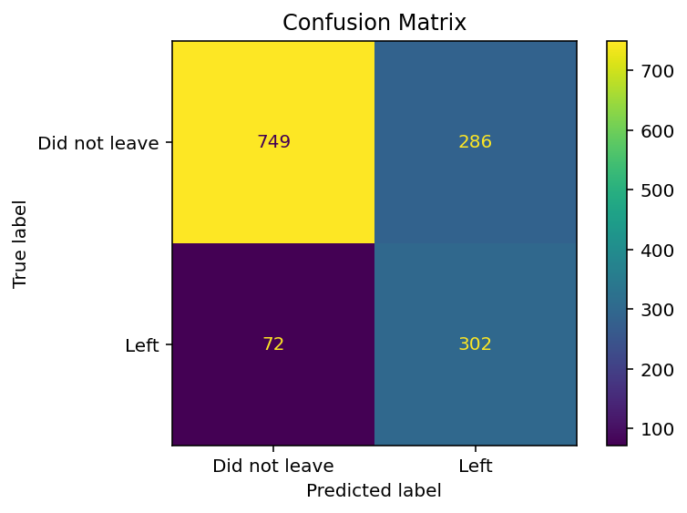
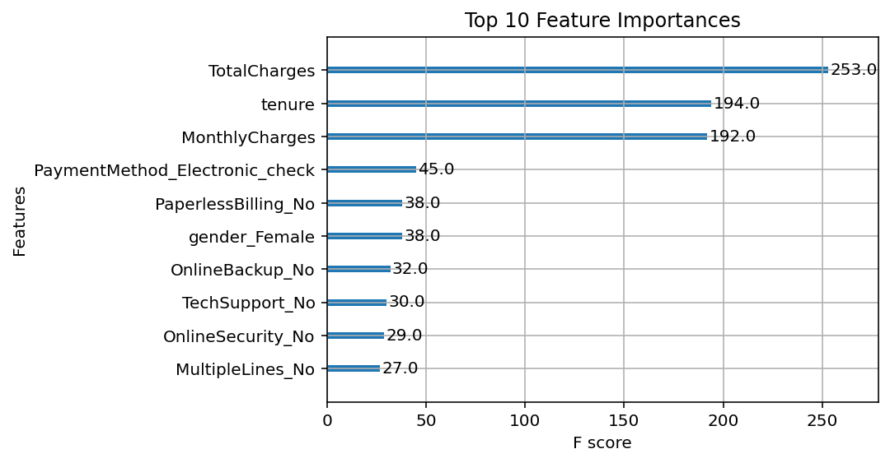
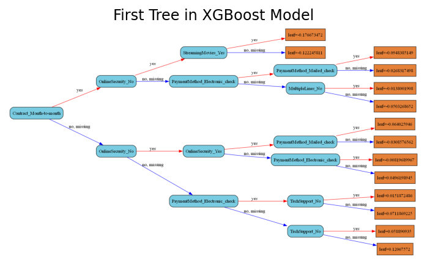

# 📊 Telco Customer Churn Prediction using XGBoost

This project aims to predict customer churn for a telecom company using the **XGBoost** classification algorithm. We built, trained, and evaluated a model using real-world customer data.

---

## 🔍 Business Impact

* **Customer Retention**:
  Identifies customers at high risk of churn, enabling proactive retention strategies.

* **Targeted Marketing**:
  Focus marketing efforts on high-risk users to reduce spend and increase effectiveness.

* **Strategic Insights**:
  Uncover key drivers of churn, informing product, pricing, and service improvements.

* **Improved Customer Service**:
  Prioritize follow-up with at-risk users before they leave.

* **Data-Driven Planning**:
  Use churn forecasts for revenue prediction and resource planning.

* **Measurable ROI**:
  Evaluate model performance using metrics like accuracy and AUC to justify investment.

---

## 📁 Dataset

The dataset used is [`Telco-Customer-Churn.csv`](https://www.kaggle.com/datasets/rhonarosecortez/telco-customer-churn), containing information on:

* Services subscribed
* Tenure and charges
* Contract and payment types
* Target: `Churn` (Yes/No)

---

## 🧼 Data Preprocessing

1. **Removed Irrelevant Features**:
   Dropped `customerID`.

2. **Handled Missing Data**:
   Converted blanks in `TotalCharges` to zero and casted to numeric.

3. **Formatted String Columns**:
   Replaced spaces with underscores for consistency.

4. **Categorical Encoding**:
   Applied one-hot encoding to all categorical features.

5. **Label Mapping**:
   Converted `Churn` from Yes/No → 1/0.

---

## 🧪 Model Training

We trained an **XGBoost Classifier** using:

```python
XGBClassifier(
    objective='binary:logistic',
    gamma=0.25,
    learning_rate=0.1,
    max_depth=4,
    reg_lambda=10,
    scale_pos_weight=3,
    subsample=0.9,
    colsample_bytree=0.5,
    seed=42,
    use_label_encoder=False
)
```

Train-test split: **80/20**, stratified on `Churn`.

---

## 📉 Evaluation

The model achieves:

* **Accuracy**: `0.75`
* **Precision (Class 1)**: `0.51`
* **Recall (Class 1)**: `0.81`
* **F1-Score (Class 1)**: `0.63`

### 🔹 Classification Report:

```
              precision    recall  f1-score   support

           0       0.91      0.72      0.81      1035
           1       0.51      0.81      0.63       374

    accuracy                           0.75      1409
   macro avg       0.71      0.77      0.72      1409
weighted avg       0.81      0.75      0.76      1409
```

### 🔹 Confusion Matrix:

|                | Predicted No | Predicted Yes |
| -------------- | ------------ | ------------- |
| **Actual No**  | 749          | 286           |
| **Actual Yes** | 72           | 302           |

Visualized:



---

## 🔍 Feature Importance

Top 10 features (based on `gain` from XGBoost booster):

```python
bst = model.get_booster()
gain_scores = bst.get_score(importance_type='gain')
```

Visualized:



---

## 🌳 Tree Visualization

First decision tree from the ensemble:



---

## 💡 Future Improvements

* Add early stopping to improve training efficiency.
* Perform hyperparameter tuning (`GridSearchCV`, `Optuna`).
* Explore advanced metrics like ROC-AUC and PR-AUC.
* Integrate SHAP for model interpretability.
* Deploy as an API using FastAPI or Flask.

---

## ⚙️ Requirements

* Python 3.x
* pandas
* numpy
* scikit-learn
* matplotlib
* xgboost (v3.0.2)

Install using conda:

```bash
conda install -c conda-forge xgboost scikit-learn matplotlib pandas numpy
```

---

## 📂 File Structure

```
├── Telco-Customer-Churn.csv
├── churn_model.py                # Main training script
├── images/
│   ├── confusion_matrix.png
│   ├── tree_visualization.png
│   └── feature_importance.png
└── README.md
```

---

## 👤 Author

**Basil Rehan**
*Data Analyst | Actuarial & Data Science Student*
*Heriot-Watt University Dubai*

---
